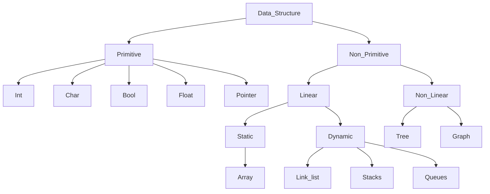

___
___
## Introduction to What is Data Structure
___
#### a real-life analogy...
- If you go out shopping at a grocery store, you would expect related items to be in the same section, such as the fruit and vegetable section, the meat section, the dairy section, etc.
These items can be further organized according to their prices and so on.

- Data Structures (DS) tutorial provides basic and advanced concepts of Data Structure. Our Data Structure tutorial is designed for beginners and professionals.

- Data Structure is a way to store and organize data so that it can be used efficiently.

- Our Data Structure tutorial includes all topics of Data Structure such as Array, Pointer, Structure, Linked List, Stack, Queue, Graph, Searching, Sorting, Programs, etc.
___
### Basic Terminologies related to Data Structures

Data Structures are the building blocks of any software or program. Selecting the suitable data structure for a program is an extremely challenging task for a programmer.

The following are some fundamental terminologies used whenever the data structures are involved:

- Data: We can define data as an elementary value or a collection of values. For example, the Employee's name and ID are the data related to the Employee.
- Data Items: A Single unit of value is known as Data Item.
- Group Items: Data Items that have subordinate data items are known as Group Items. For example, an employee's name can have a first, middle, and last name.
- Elementary Items: Data Items that are unable to divide into sub-items are known as Elementary Items. For example, the ID of an Employee.
- Entity and Attribute: A class of certain objects is represented by an Entity. It consists of different Attributes. Each Attribute symbolizes the specific property of that Entity.
Entities with similar attributes form an Entity Set. Each attribute of an entity set has a range of values, the set of all possible values that could be assigned to the specific attribute.

The term "information" is sometimes utilized for data with given attributes of meaningful or processed data.
- Field: A single elementary unit of information symbolizing the Attribute of an Entity is known as Field
- Record: A collection of different data items are known as a Record. For example, if we talk about the employee entity, then its name, id, address, and job title can be grouped to form the record for the employee.
- File: A collection of different Records of one entity type is known as a File. For example, if there are 100 employees, there will be 25 records in the related file containing data about each employee.
___
## What is Data Structure?
- Data Structure is a branch of Computer Science. The study of data structure allows us to understand the organization of data and the management of the data flow in order to increase the efficiency of any process or program. Data Structure is a particular way of storing and organizing data in the memory of the computer so that these data can easily be retrieved and efficiently utilized in the future when required. The data can be managed in various ways, like the logical or mathematical model for a specific organization of data is known as a data structure.
- Data structure refers to the organization of data in memory or storage devices such as RAM, ROM etc., for efficient access and modification by computer programs. i.e.. array
Array is a collection of memory elements in which data is stored sequentially, i.e., one after another. In other words, we can say that array stores the elements in a continuous manner. This organization of data is done with the help of an array of data structures. There are also other ways to organize the data in memory.
- The data structure is not any programming language like C, C++, java, etc. It is a set of algorithms that we can use in any programming language to structure the data in the memory.
___

## Types of Data Structure

### Primitive data structure
- The primitive data structures are primitive data types. The int, char, float, double, and pointer are the primitive data structures that can hold a single value.
- Primitive data types are also known as in-built data types.
- Primitive data structure is the data structure that allows you to store only single data type values.
- Primitive data structure always contains some value i.e. these data structures do not allow you to store NULL values.
- The size of the primitive data structures is dependent on the type of the primitive data structure.
  
### Non-Primitive Data Structure
- Non-primitive data structures are the data structure created by the programmer with the help of primitive data structures. Non-primitive data structures are divided into linear and non-linear data structures. Arrays and linked lists are examples of linear data structure and trees, graph are examples of non-linear data structure.
- It is also known as derived data types or reference data types.
- Non-Primitive data structure is a data structure that allows you to store multiple data type values.
- You can store a NULL value in the non-primitive data structures.
- The size of the non-primitive data structure is not fixed.

##### Non-Primitive Data Structure
  - Linear Data Structure
  - Non Linear data Structure

#### 1) Linear Data Structures:
- The arrangement of data in a sequential manner is known as a linear data structure. The data structures used for this purpose are Arrays, Linked list, Stacks, and Queues. In these data structures, one element is connected to only one another element in a linear form.

- Linear Data Structure
  - Static Data Structure : It is a type of data structure where the size is allocated at the compile time. Therefore, the maximum size is fixed.
  - Dynamic Data Structure :  It is a type of data structure where the size is allocated at the run time. Therefore, the maximum size is flexible.

#### 1) Non-Linear Data Structures:
- Data structures where data elements are not arranged sequentially or linearly are called non-linear data structures. In a non-linear data structure, single level is not involved. Therefore, we can’t traverse all the elements in single run only. Non-linear data structures are not easy to implement in comparison to linear data structure. It utilizes computer memory efficiently in comparison to a linear data structure. Its examples are trees and graphs.  

### Major Operations

- The major or the common operations that can be performed on the data structures are:
  - Searching: We can search for any element in a data structure.
  - Sorting: We can sort the elements of a data structure either in an ascending or descending order.
  - Insertion: We can also insert the new element in a data structure.
  - Updation: We can also update the element, i.e., we can replace the element with another element.
  - Deletion: We can also perform the delete operation to remove the element from the data structure.

